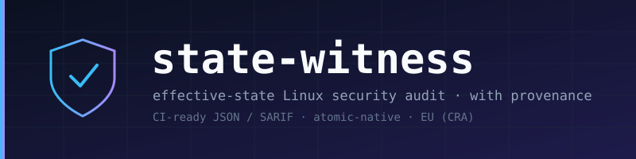
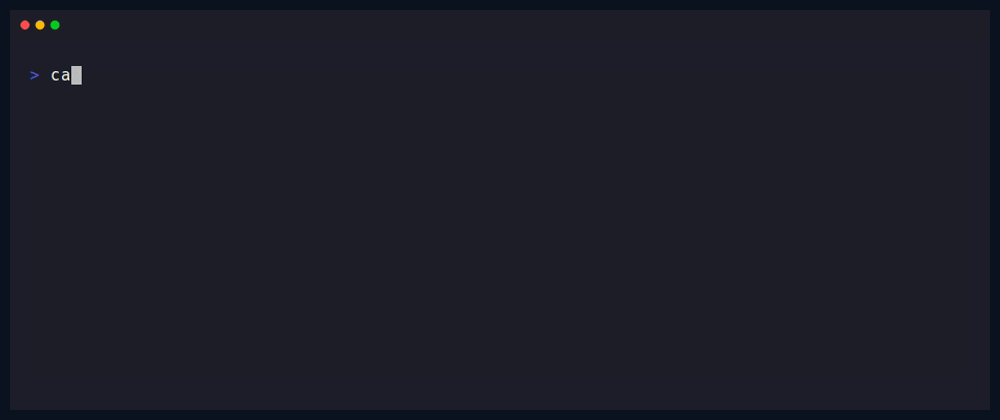

<div align="center">



[](CHANGELOG.md)
[](#license)
[](https://www.rust-lang.org)
[](#contributing)



</div>

# state-witness

> **The effective-state security auditor built for immutable Linux.** — Fedora Atomic, Bazzite, and `bootc` / RHEL Image Mode.

> Reports what your host **actually enforces** — with **deployment provenance** — not what a config file claims. **Native Rust, single static binary, no CINC/Ruby engine.**
>
> Existing tools read the file; attackers read the drop-in. `state-witness` reads the resolved runtime state (`sshd -T`, `sysctl`, `systemctl show`, `auditctl -l`) and understands ostree/`bootc` deployments (immutable `/usr`, `/etc` drift, signed commits).

**Status:** v0.0.1 (scaffold; `ssh` check working) · **Changelog:** `CHANGELOG.md`

---

## AI usage & authorship

This project is **spec-driven and human-owned**. AI tools are used as an assistant, not an author.

- **Workflow:** I write the spec and tests → AI helps implement to spec → I review every line I don't fully understand → I verify with `cargo test` / `cargo clippy` / manual checks.
- **What AI is used for:** boilerplate (CLI parsing, serde, docs), test scaffolding, and explanation of unfamiliar APIs.
- **What AI is NOT used for:** security-critical logic, trust boundaries, or architecture decisions — those are designed and reviewed by hand.
- **Accountability:** I can explain and justify every design and code decision. Design rationale lives in `ADR.md`.
- **Provenance:** AI-assisted commits are noted in the commit message (model + that it was reviewed/verified).

> The rule: **AI drafts, the human owns.** If I can't explain a line, it doesn't ship.

---

## Why
Existing tools (Lynis, OpenSCAP) audit *what the config file says*. `state-witness` audits *what the kernel and daemons actually enforce right now*, and tells you **exactly which line set it**.

- 🎯 **Effective state** — `sshd -T`, `sysctl -n`, `nft list ruleset`, `systemctl show`, `/proc`, live sockets
- 🔎 **Provenance** — "`PasswordAuthentication yes` is effective; resolved from `/etc/ssh/sshd_config.d/50-cloud.conf` line 4, overriding line 61"
- 🤖 **CI-first** — versioned JSON + SARIF 2.1.0 + exit codes
- 🧊 **Atomic/ostree-native** — knows `/usr` is read-only; detects `/etc` drift via `ostree admin config-diff`
- 🛡️ **Safe** — read-only by default; remediation via drop-ins with rollback
- ⚖️ **Legally clean** — maps to NIST / CRA / BSI; never ships CIS content

## Why atomic/ostree matters

Immutable/atomic hosts (Fedora Atomic, Bazzite, `bootc`/RHEL Image Mode, Universal Blue) are the fastest-growing part of the Linux fleet — and the least audited:

- **`/usr` is read-only** (managed by `rpm-ostree`/`bootc`); tools that probe or remediate via `dnf` break.
- **Config layering** — a 3-way merge of `/usr/etc` → `/etc` means the "effective" file may not be where a scanner looks.
- **Deployments are signed and versioned** — a provenance goldmine almost no audit tool consumes.
- Most scanners either **fail** here or **silently misdetect** the host and produce a confident-but-wrong grade.

`state-witness` treats the atomic deployment as a **first-class fact**: which deployment you're on, whether it's signed, what `/etc` drift exists, and whether the enforced service state is consistent — in one native binary, with no external engine.

### How it compares

| Capability | `state-witness` | Lynis | OpenSCAP |
|---|---|---|---|
| Reads **effective** runtime state (`sshd -T`, `sysctl -n`, live sockets) | ✅ | partial (mostly files) | ❌ (file content) |
| **Provenance** — which file **and line** set the value | ✅ | ❌ | ❌ |
| **Atomic/ostree/bootc-aware** (read-only `/usr`, deploy detection) | ✅ | ❌ (probes `dnf`) | ❌ (assumes mutable host) |
| Detects **`/etc` drift** on atomic hosts | ✅ | ❌ | ❌ |
| Signed-deployment / provenance facts | ✅ | ❌ | partial |
| Output formats | text · JSON · SARIF *(planned)* | text · log | XML · HTML · ARF |
| Runtime | single **static Rust** binary (no engine) | Bash + rule files | Python/`oscap` engine |
| Remediation | drop-in `--plan/--apply` + rollback *(planned)* | manual | remediate via `oscap` |
| Compliance mapping | NIST / CRA / BSI *(planned)* | built-in profiles | SCAP profiles (authoritative) |

**Read this honestly:** OpenSCAP is the reference for formal SCAP/compliance content; Lynis is the veteran for broad, file-based hardening checks. Neither treats an **immutable/atomic host as a first-class citizen** — that is the gap `state-witness` targets, and it complements them rather than replacing them.

## Install
```bash
# from source (works today)
git clone https://github.com/7sh1d0w7x/state-witness
cd state-witness
cargo build --release
sudo ./target/release/state-witness ssh

# crates.io (planned)
cargo install state-witness
```

## Usage (v0.0.1)
```bash
# effective SSH config (needs root: sshd -T reads host keys)
sudo state-witness ssh
# ✗ PermitRootLogin: prohibit-password
#   └─ from (effective, sshd -T)
# ✗ PasswordAuthentication: yes
#   └─ from (effective, sshd -T)

# machine-readable (CI)
sudo state-witness ssh --json

# exit code: 0 = all pass/warn/skip · 1 = any fail
```

*Planned:* `scan` (12 checks) · `--format sarif` · `fix --plan/--apply` · `rollback`.

## What it checks (MVP, 12)
SSH effective auth + crypto · sysctl effective vs persisted · firewall effective ruleset · listening sockets · file capabilities · SUID/SGID · SELinux/AppArmor enforcement · systemd service hardening · audit subsystem · users & sudo · kernel protections · atomic `/etc` drift.

## Design in one screen
```
Fact     = typed value + provenance(path,line) + access(Root|Unprivileged|Cap)
Probe    = Rust fn collecting one Fact (declares privilege need)
Rule     = declarative predicate over Facts (TOML; data, NEVER a script)
Finding  = rule_id, status, severity, evidence, provenance, controls[]
```
Collect once, assert many. Probes testable against recorded fixtures; rules testable against synthetic fact sets.

## Business model
**Open-core:** `scan` single-host gratis → fleet + compliance dashboard plătit. Zero cold sales.

## License
MIT OR Apache-2.0 (Rust convention).

---
*Research: `../../strategy/research/proiecte/project-direction-2026.md` · Design brief (29 sep 2026)*
